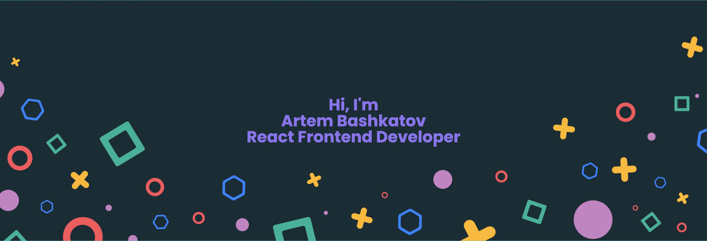

Я Артем.

Работаю в стэке React и у меня более 4 лет опыта Frontend разработчиком.

Также я работал с Vue, Angular, есть понимание смежных фреймворков, что позволило расширить кругозор.

  

Growth mindset для меня не пустой звук, стараюсь выделять время на саморазвитие, но не забываю про life-balance и слежу, чтобы не было burnout (выгорания).

  

Профильное образование в сфере IT, читаю/изучаю фундаментальные знания по computer science и system design.

Английский язык уровня B1, из спорта нравится - бег ~~от дедлайнов~~ на беговой дорожке.

&nbsp;

Мои **hard-skills**:

**Языки программирования:** JavaScript/TypeScript

**Управление состоянием/стэйт менеджеры:** Redux (Redux Toolkit, Deox), MobX (Mobx MST), Effector

**Архитектура Frontend проекта:** Feature Sliced Design, Clean Architecture

**Веб (разметка и стилизация):** HTML 5, CSS 3

**Инфраструктура и сборщики приложений:** Docker, Webpack, Vite, EsBuild, SWC, Rollup (для библиотек и ESM модулей)

**Тестирование:** Jest, Cypress, Playwright, react-testing library

**SSR:** NextJS, Astro, custom NodeJS + Express + React render to string, Stream API

**Бэкенд:** Node/Express, FastAPI

**Другое:** Conventional Commits, Git, Storybook, es-lint, prettier

**Протоколы обмена данными:** gRPC, WebSockets, HTTP

**Стилизация компонентов и UI:** SASS/SCSS, styled-components, emotion, stitches, vanilla-extract, linaria, css-modules, tailwind, PostCSS

&nbsp;
&nbsp;

Мои **soft-skills** на уровне:

- менторинга коллег,

- написания внутренних статей для компании и отдела маркетинга,

- налаживания коммуникаций в команде, а также эмпатия во время code-review,

- умею работать в больших командах, с Тимлидом, Solution Architect и бизнес-аналитиками, а также QA (команды от 7 человек и более),

- слушаю и воспринимаю замечания дизайнеров (pixel-perfect, но без излишнего энтузиазма)

&nbsp;

Я люблю дэйли созвоны, ретро.

Особенно когда производится работа и даётся фидбэк, к команде прислушиваются.

  

Мне важна культура компании, не токсичное руководство и тот самый дружный коллектив.

Дайте мне кофе и я переверну весь мир :)

Random Facts: у меня 2 кошки и я люблю сельдереевый смузи с бананом
